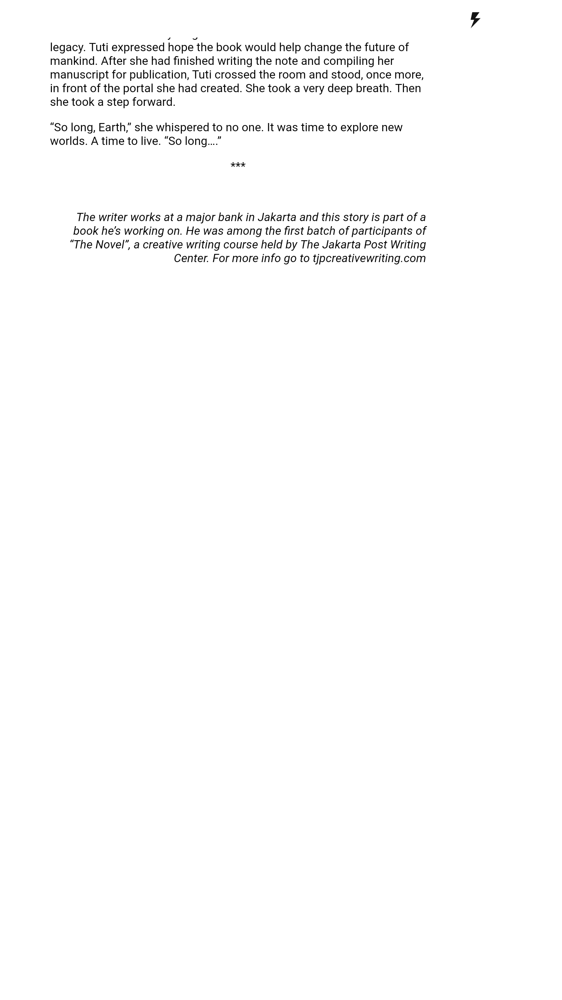

# FuseTools Wordpress Single Post

An example how to display richtext from JSON into WebView in Fusetools.

This project is currently under development.

## Screenshots

<kbd>
  Plain Post
   
   
</kbd>

<kbd>
  HTML Post
   
   
</kbd>

<kbd>
  HTML Post with much white space at the bottom of webview
   
   
</kbd>
