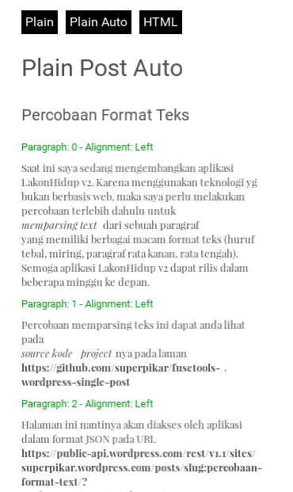

# FuseTools Wordpress Single Post

An example how to display richtext from JSON into WebView in Fusetools.

Able to display text : 
- italic
- bold
- center align
- right align

This project is currently under development.

## Screenshots

Plain Post
 
<kbd>
   
</kbd>

Plain Formatted Post
 
<kbd>
   
</kbd>

HTML Post
 
<kbd>
   
</kbd>

