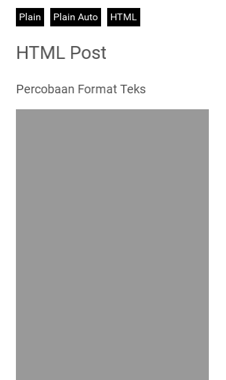

# FuseTools Wordpress Single Post

An example how to display richtext from JSON into WebView in Fusetools.

This project is currently under development.

## Screenshots
Plain Post

<kbd>
   
</kbd>

HTML Post

<kbd>
   
</kbd>